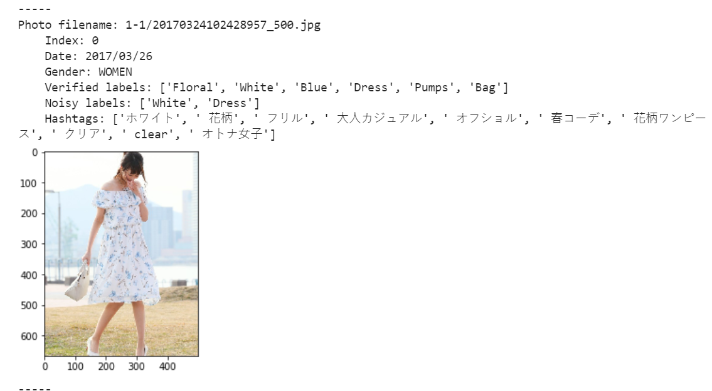
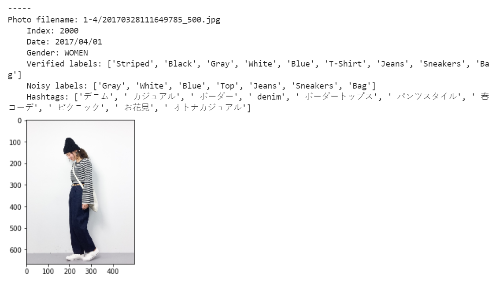
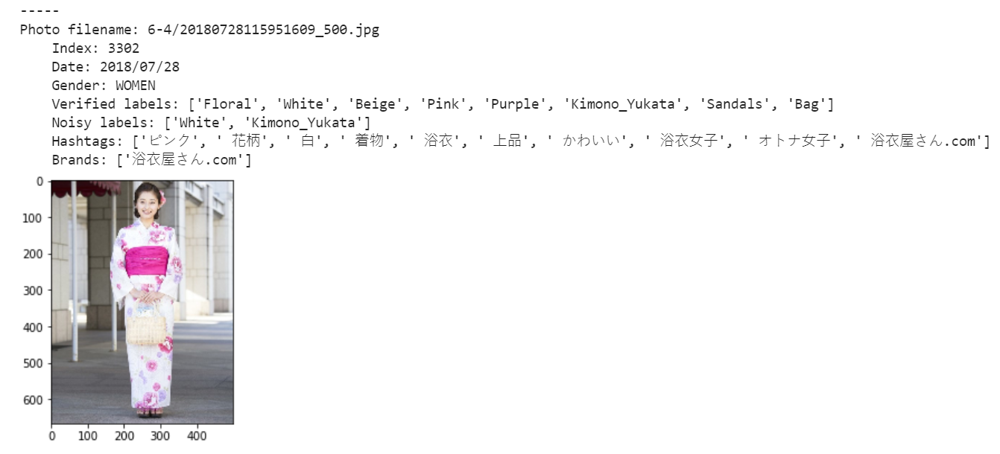
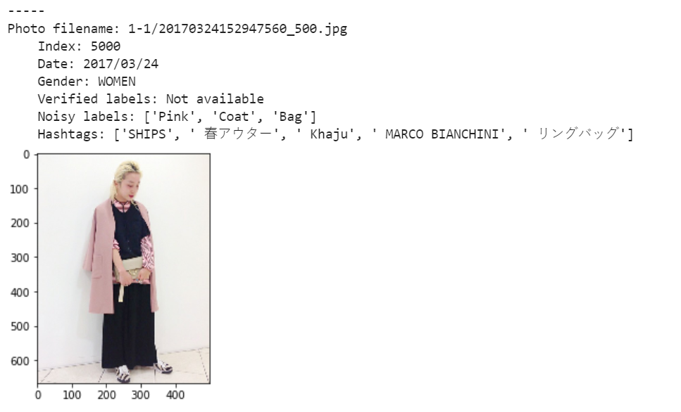

RichWear Dataset
=================
RichWear dataset contains 321,698 street fashion images collected from wear.jp spanning from 2017 to 2019. All images are of size 500x667 pixels. Each image is associated with a date, gender of the character in the image, user-provided clothing brands, hashtags, colors, and categories. We also provide manually verified clothing patterns, colors, and categories of 3,868 images. 

This dataset is suitable for analyzing street fashion trends or training fashion attribute recognition models. 

Download the dataset here (30GB; Right click to save as): [http://www.im.ntu.edu.tw/~lu/data/richwear/richwear.tgz](http://www.im.ntu.edu.tw/~lu/data/richwear/richwear.tgz)

If you are using this dataset, please cite our work:  
**Fu-Hsien Huang, Hsin-Min Lu, and Yao-Wen Hsu, (2021, Mar.). From Street Photos to Fashion Trends: Leveraging User-Provided Noisy Labels for Fashion Understanding, IEEE Access, Forthcoming, https://doi.org/10.1109/ACCESS.2021.3069245**

<pre>
@ARTICLE{IEEEACstreetphoto2021,  
   author={F. -H. {Huang} and H. -M. {Lu} and Y. -W. {Hsu}},  
   journal={IEEE Access},   
   title={From Street Photos to Fashion Trends: Leveraging User-Provided Noisy Labels for Fashion Understanding},   
   year={2021},  
   volume={},  
   number={},  
   pages={1-1},  
   doi={10.1109/ACCESS.2021.3069245}}
</pre>

In addition to RichWear, we also provide the [revised Fashion550K](https://github.com/hsinmin/revised_fashion550k). Revised Fashion550K contains 4307 images with manually corrected labels. The label set in revised Fashion550K is compatible with that used in RichWear. 

----

* `classes.txt`           # 41 unique classes appeared in clothing patterns, colors, and categories.

* `photos.txt`            # List of image filenames. Note that the first 3,868 files are from the verified\
                            subset in the following order: 3,043 training, 325 validation, and 500 test images. \
                            The rest of images does not have verifed labels. These images only have noisy labels.

* `date.txt`              # Date uploaded to wear.jp (in the same order as photos.txt).

* `brands.txt`            # Clothing brands (in the same order as photos.txt).

* `gender.txt`            # Gender of users (in the same order as photos.txt).

* `hashtags.txt`          # User-created hashtags (in the same order as photos.txt).

* `label_verified.txt`    # Human-verified labels (for the first 3,868 filenames in photos.txt).

* `label_noisy.txt`       # User-provied noisy labels (in the same order as photos.txt).

* `image_and_tag.ipynb`   # Example python program that displays images and their tags.

* `photos`                # The folder containing all images.

Note that 'nan' denotes missing data.

----
Example images and their tags:

 
 
